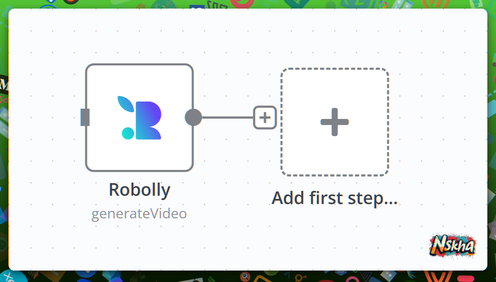

# Robolly Node for n8n - Graphic Generation Service



Robolly Node is a robust integration for n8n that enables seamless interaction with the Robolly API. With this node, you can generate high-quality images and videos and easily manage templates within your n8n workflows. It’s designed to help automate creative content generation with advanced customization options.

---

## Table of Contents
1. [Overview](#overview)
2. [Exclusive Features](#exclusive-features)
3. [Installation](#installation)
4. [Configuration](#configuration)
5. [Operations](#operations)
6. [Node Fields](#node-fields)
7. [Examples](#examples)
8. [Troubleshooting](#troubleshooting)
9. [Support](#support)

---

## Overview

The Robolly Node integrates with the Robolly API to offer powerful functionalities including:

- **Image Generation**: Create customizable, high-quality images.
- **Video Generation**: Produce dynamic videos with transitions and effects.
- **Template Management**: Retrieve and manage templates for both images and videos.
- **Render Management**: Access and manage previously generated renders.

This node is ideal for automating workflows such as social media content, marketing materials, course certificates, and personalized media.

---

## Exclusive Features

### Custom Image Formats
- **AVIF**: Next-gen format with superior compression.
- **WebP**: Modern format with excellent compression.
- **TIFF**: High-quality, lossless format.

### Custom Video Formats
- **AV1**: High-efficiency codec with excellent compression.
- **WebP**: Animation format with efficient compression.
- **WebM**: Video format with effective compression.
- **GIF**: Widely compatible animation format.
- **H.264 (AVC)**: Well-supported video codec.
- **HEVC (H.265)**: Enhanced video coding with improved compression.
- **VP9**: Open-source codec offering efficient compression.

### Additional Features
- **Binary & JSON Output**: Retrieve outputs in both binary and JSON formats.
- **Render Link**: Generate a Base64-encoded render link.
- **Movie Generation**: Manually request API integration data.

---

## Installation

### Option 1: n8n GUI Installation 
1. Open your n8n instance and navigate to the **Settings/Community Nodes** panel.
2. Click **Install**.
3. Enter `nskha@n8n-nodes-robolly` and click **Install**.
4. Accept the Community Nodes License.
5. Wait for the installation to complete.
6. Locate **Robolly** in your nodes list.

### Option 2: n8n CLI Installation
1. Run the following command:
   ```bash
   npm install nskha@n8n-nodes-robolly
   ```
2. Restart your n8n server.
3. Add the **Robolly** node to your workflow via the node panel.

### Option 3: Docker Installation
Add the following to your Dockerfile:
```dockerfile
# Switch to root user to install the node
USER root

# Install the Robolly node in a custom path (recommended outside the volume)
RUN npm install --prefix /home/node/nskha-custom-nodes nskha@n8n-nodes-robolly@latest

# Configure allowed external modules:
# NODE_FUNCTION_ALLOW_EXTERNAL=*
# OR (for only our nodes)
# NODE_FUNCTION_ALLOW_EXTERNAL=nskha@*

# Switch back to the node user
USER node
```

---

## Configuration

### API Credentials
1. **Obtain API Key**:  
   Log in to your Robolly account and generate an API key from the [API Settings](https://robolly.com/settings/api).

2. **Configure in n8n**:  
   - Select the **Robolly** node in your workflow.
   - Click **Credentials**.
   - Enter your API key and save.

---

## Operations

The Robolly Node supports several operations:

### 1. Get Templates
Retrieve a list of available templates for image or video generation.
- **Fields**:
  - `Templates Type`: Filter by image, video, or all.
  - `Return All Items`: Retrieve all templates or limit the results.

### 2. Get Template Elements
Retrieve and customize template elements.
- **Field**:
  - `Template Name or ID`: Specify the template to retrieve elements from.

### 3. Generate Image
Create an image based on a selected template.
- **Fields**:
  - `Image Template`: Choose the template.
  - `Image Format`: Select the output format (JPG or PNG).
  - `Image Scale`: Adjust the scale (default, low, high, or super high quality).
  - `Template Elements`: Customize elements like text and colors.

### 4. Generate Video
Produce a video based on a selected template.
- **Fields**:
  - `Video Template`: Choose the template.
  - `Template Elements`: Customize transitions, effects, etc.

### 5. Get Renders
Access previously generated renders.
- **Field**:
  - `Return All Items`: Retrieve all renders or limit the output.

---

## Node Fields

### Public Fields
- **Render Link**: Generate a Base64-encoded render link.
- **Movie Generation**: Manually request API integration JSON data.

### Image Generation Fields
- **Image Template**
- **Image Format**
- **Image Scale**
- **Template Elements**

### Video Generation Fields
- **Video Template**
- **Template Elements**

### Template Retrieval Fields
- **Templates Type**

---

## Examples

### Example 1: Generate an Image
1. Add the **Robolly** node to your workflow.
2. Select the `Generate Image` operation.
3. Choose an image template and customize the settings (format, scale, elements).
4. Execute the workflow to generate the image.

### Example 2: Retrieve Templates
1. Add the **Robolly** node to your workflow.
2. Select the `Get Templates` operation.
3. Filter templates by type (image, video, or all).
4. Execute the workflow to retrieve the template list.

---

## Troubleshooting

### Common Issues
- **Invalid API Key**: Verify that your API key is correctly entered.
- **Large Data Retrieval**: Use the `Limit` field to control the number of items returned.
- **Template Not Found**: Confirm that the specified template ID exists in your Robolly account.

---

## Support

### Robolly Support
- **Documentation**: [Robolly API Reference](https://robolly.com/docs/api-reference/)
- **Community**: Join the [Robolly Community Forum on Facebook](https://www.facebook.com/groups/1253651508558627)

### n8n Support
- **GitHub**: [n8n GitHub Repository](https://github.com/n8n-io/n8n)
- **Community Forum**: [n8n Community Forum](https://community.n8n.io/)

### Robolly Node Support
- **GitHub**: [Robolly Custom Node Repository](https://github.com/automations-project/n8n-nodes-robolly)
- **Discord**: Join the [Nskha Discord Server](https://discord.gg/nskha)

---